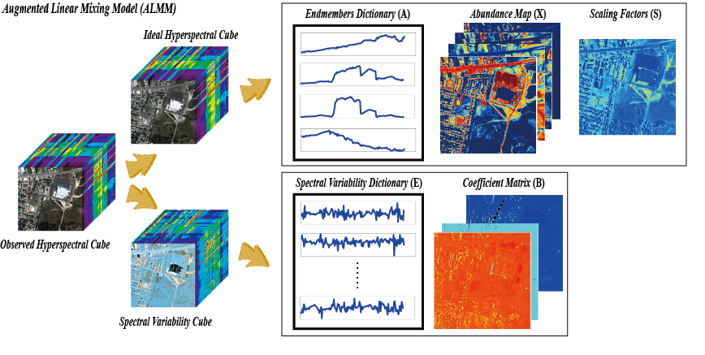

# An Augmented Linear Mixing Model to Address Spectral Variability for Hyperspectral Unmixing

Danfeng Hong, Naoto Yokoya, Jocelyn Chanussot, Xiaoxiang Zhu
---------------------

**Please note that this is an updated version (ALMM_v1), the main improvement lies in the following three parts:**

1) the updated code is able to input non-grid HSI (e.g., the size is 107 * 107, not only limiting to e.g., 100 * 100);
2) a blind ALMM code is added in this toolbox as well, which enables simultaneous abundance estimation and endmember extraction;
3) we correct a problem that the final abundance maps can not be imshown correctly.

The code in this toolbox implements the ["An augmented linear mixing model to address spectral variability for hyperspectral unmixing"](https://ieeexplore.ieee.org/document/8528557).
More specifically, it is detailed as follow

Citation
---------------------

**Please kindly cite the papers if this code is useful and helpful for your research.**

Danfeng Hong, Naoto Yokoya, Jocelyn Chanussot, Xiao Xiang Zhu. An Augmented Linear Mixing Model to Address Spectral Variability for Hyperspectral Unmixing, IEEE Transactions on Image Processing, 2019, 28(4): 1923-1938.

     @article{hong2019augmented,
     title     = {An Augmented Linear Mixing Model to Address Spectral Variability for Hyperspectral Unmixing},
     author    = {D. Hong and N. Yokoya and J. Chanussot and X. Zhu},
     journal   = {IEEE Trans. Image Process.},
     volume    = {28},
     number    = {4},
     pages     = {1923--1938},
     year      = {2019},
     publisher = {IEEE}}

System-specific notes
---------------------
The code was tested in Matlab R2016a or higher versions on Windows 10 machines.

How to use it?
---------------------

Directly run demo.m to reproduce the results on the synthetic data, which exists in the aforementioned paper.  
Note that the simulated data can be downloaded from  
[google drive](https://drive.google.com/open?id=1r1a6hP8fkwnMFGG2ATG5PM_I3gHVG-3U)  
[baiduyun](https://pan.baidu.com/s/1ABbWgkEkzp2Q02yjeYjxvw): ivb0 (access code).

If you want to run the code in your own data, you can accordingly change the input (e.g., data) and tune the parameters.
Please note that 
1) the shape of the input matrix.
2) when you are running the code in parallel, that is, you have to seperate the input HSI into some patches,
in our code, the patch must be square (length = width).
3) if the endmemebers are not given in advance, the code would automatically extract the endmembers from HSI using VCA [1].

If you encounter the bugs while using this code, please do not hesitate to contact us.

Acknowledgment
---------------------

We would like to thank Prof. Jose M. Bioucas Dias for providing the Matlab Codes of SUnSAL [2] and Dr.Lucas Drumetz for providing
the synthetic data [3] used in our paper.

Codes for the SUnSAL can be found in the link of http://www.lx.it.pt/~bioucas/publications.html.

If you want to use the codes and data mentioned above, please cite the corresponding articles as well.
In addition, please feel free to contact me if you are interested in the other datasets or codes.

References:  
[1] J.M. Nascimento, J.M. Bioucas-Dias. "Vertex component analysis: A fast algorithm to unmix hyperspectral data." IEEE transactions on Geoscience and Remote Sensing, 2005, 43(4), pp.898-910.  
[2] J.M. Bioucas-Dias, M.A. Figueiredo. "Alternating direction algorithms for constrained sparse regression: Application to hyperspectral unmixing." In proc. WHISPERS, 2010, pp. 1-4.  
[3] L. Drumetz, M.A. Veganzones, S. Henrot, R. Phlypo, J. Chanussot and C. Jutten. "Blind hyperspectral unmixing using an extended linear mixing model to address spectral variability." IEEE Transactions on Image Processing, 2016, 25(8), pp.3890-3905.  
[4] D. Hong, N. Yokoya, J. Chanussot, and X. Zhu. "Learning a low-coherence dictionary to address spectral variability for hyperspectral unmixing." In proc. ICIP, 2017, pp. 235-239.  
[5] D. Hong, N. Yokoya, J. Chanussot, and X. Zhu. "An augmented linear mixing model to address spectral variability for hyperspectral unmixing." IEEE Transactions on Image Processing, 2019, 28(4), pp.1923-1938.  
[6] D. Hong, X. Zhu. "SULoRA: Subspace unmixing with low-rank attribute embedding for hyperspectral data analysis." IEEE Journal of Selected Topics in Signal Processing, 2018, 12(6), pp. 1351-1363.  

Licensing
---------

Copyright (C) 2019 Danfeng Hong

This program is free software: you can redistribute it and/or modify it under the terms of the GNU General Public License as published by the Free Software Foundation, version 3 of the License.

This program is distributed in the hope that it will be useful, but WITHOUT ANY WARRANTY; without even the implied warranty of MERCHANTABILITY or FITNESS FOR A PARTICULAR PURPOSE. See the GNU General Public License for more details.

You should have received a copy of the GNU General Public License along with this program.

Contact Information:
--------------------

Danfeng Hong: hongdanfeng1989@gmail.com 
Danfeng Hong is with the Remote Sensing Technology Institute (IMF), German Aerospace Center (DLR), Germany;  
&nbsp; &nbsp; &nbsp; &nbsp; &nbsp; &nbsp; &nbsp; &nbsp; &nbsp; &nbsp; &nbsp; &nbsp; &nbsp; &nbsp; with the Singnal Processing in Earth Oberservation (SiPEO), Technical University of Munich (TUM), Germany. 
